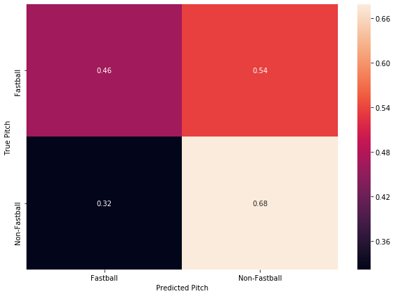

# Do You Really Need Trash Cans?
February 26, 2020

-------------------------------------
The 2019–2020 MLB off-season was dominated by the revelation that the Houston Astros stole opposing pitcher’s signs during their 2017 World Series-winning season. This was accomplished by looking at a live camera feed from center field in an area just off the dugout and communicating the next pitch to the batter by banging on a trash can. This got me thinking, “Could machine learning predict what pitch was coming next? Do you even need to be stealing signs, or just a computer?”

Photo by Lesly Juarez on Unsplash

## The Astros Scheme
The Astros scheme has been very well covered by now. I won’t delve into the specifics of their cheating, but two specific things are relevant to the goal of predicting the next pitch with machine learning. First, they only seemed to bang the trash can if the next pitch wasn’t going to be a fastball. This means they were not specifying what specific type of pitch it was, but only communicating if the pitch was going to be off-speed. Second is that Rob Arthur from Baseball Prospectus determined that the Astros correctly determined that a non-fastball was coming towards the plate 93% of the time.

> “By and large, the Astros tended to get the signals right, but it was hardly perfect. They were most accurate when they whacked the can: When they did so, a non-fastball was on the way 93 percent of the time and they were wrong seven percent of the time. … Based on Adams’ data, the Astros used the trash can frequently and they were relatively accurate, moreso when banging than when silent.”

(Source: https://blogs.fangraphs.com/the-most-important-bangs-of-the-astros-scheme/)

So, in order for our machine learning model to be comparable to the Astros’ scheme, it must predict between fastball and non-fastball pitches, and do so with a pretty high degree of accuracy.

## The Data
The great thing about applying analytics and machine learning to baseball is that there is a wealth of data freely available and easily accessible. Since I am using Python, I opted to use the pybaseball Python package, which provides a wrapper for Statcast data, which has entries of every pitch thrown in the MLB, including the game state, such as the inning, who is on base, and what the current count is. Also included are what hand the pitcher throws with and the hitter’s stance. Crucially, Statcast also provides what type of pitch is thrown and its velocity. From this, I created a previous pitch and previous pitch velocity column.

Once the data was pulled from Statcast and massaged a bit, I split it into a training and testing set. A problem that came up during the training process was that the dominant pitch in baseball is the fastball, and therefore there were many more cases of pitchers throwing a fastball then there was of pitchers throwing non-fastballs. This imbalance meant that the machine learning algorithms achieved very good accuracy by predicting the next pitch was always going to be a fastball. Obviously this isn’t very helpful, so to counter this I used SMOTE to create synthetic non-fastball training data, leaving us with a balanced training dataset between all different types of pitches.

In this analysis, we will use two different datasets, one consisting of Jose Berrios’ pitches from the beginning of the 2017 season through the end of the 2019 season, and a set of all pitches thrown in every MLB game between April 1st, 2019 and April 7th, 2019. These two datasets will allow us to see if individual pitchers’ habits are easier to predict compared to league-wide preferences on deciding what pitch to throw in a given situation.

With these two different datasets, I also created a version of each that only contains if the pitch thrown was a fastball or a non-fastball. For this version of the data, I considered four-seam fastballs, two-seam fastballs, and cutters as “fastballs” and everything else as a non-fastball. I am taking an educated guess here that this is what the Astros considered a fastball as well.

## The Models
I started with some “basic” machine learning models such as Decision Trees, SVMs and k-Nearest Neighbors. These models all had abysmal accuracy (lower than 50%) on all datasets. I then decided to feed the data into two different neural networks: one for each version of the dataset.

### The Jose Berrios Models
These models achieved better accuracy than our other approaches, with the multi-pitch classifier achieving 74% accuracy on the test set, and the fastball/no-fastball classifier achieving 58% accuracy. It is unclear to me why there is such a discrepancy between these two classifiers, but lets dive into the confusion matrices they produced.

Looking at the confusion matrix above, we can see how many of the pitches of a given type matched the predicted type by looking at the diagonal of the matrix. For example, the model correctly predicted 52% of the curveballs thrown. Looking across the rows of the matrix tells you what percentage of the true pitch were misclassified as a different type of pitch. Looking at the curveball row (labelled “CU”), we can see that 52% the model predicted successfully, while 20% of the time it predicted that a changeup was going to be the next pitch. A two-seam fastball was the next most predicted at 18% of the time, followed by a four-seam fastball at about 10% of the time. If you turned this into banging on a trash can, about 30% of the time you would be wrong. While the true accuracy of this model was pretty good, turning its predictions into actionable results would be difficult, and is still far behind the Astros’ accuracy.

Above is the confusion matrix for the fastball/non-fastball classifier. As you can see, our true positive and true negative rate was very similar, which leads us to the accuracy of about 58%. Unlike the multi-pitch classifier, the outcome was relatively balanced. This is a good thing, as we want to reduce both the number of false positives and false negatives, but both of these percentages result in a worse outcome for our trash can banger: only about 60% of the time they would be correct. Maybe our league-wide data will fare better?

### The League-Wide Models
The league-wide classifier for all pitches was 88% accurate on the testing set, but as before, let's look at the confusion matrix below:

As you can see, there isn’t that much improvement in terms of improving the trash-can bang’s accuracy compared to the pitcher-specific model. The model predicts correctly that a four-seam fastball is going to be thrown 43% of the time it actually is, with it predicting that a curveball or a slider is going to be thrown about 20% of the time. Including a two-seam fastball’s prediction gets us to correctly predicting that the pitch is going to be either a four or two-seam fastball is only about 51%. Clearly still not good enough accuracy for the batters to gain any benefit from the model. Maybe the fastball/non-fastball classifier will produce better results this time?

So, obviously this isn’t a great outcome either. The test set accuracy was 57%, and as the confusion matrix shows, the number of false positives was extremely high. This means that our trash-can would bang 54% of the time there was a fastball coming, when it is only supposed to bang on a non-fastball pitch. The classifier did a slightly better job predicting when a non-fastball was coming, but still had a false negative rate of 32%. This means that the trash can wouldn’t be banged 32% of the time a non-fastball was pitched. This model would be of absolutely no help to the batter.

## Conclusion
Coming into this project, I thought that machine learning might be able to predict what the next pitch would be to a high enough accuracy where it might be beneficial to a batter. This is obviously not the case. Even with some models producing an accuracy of greater than 75%, the false positive and false negative rates are great enough that there would be no discernible benefit. Different architectures of neural networks and more data surrounding each pitch could possibly produce better accuracy, but I’m now skeptical if it would help that much. For now, however, the best way to know what the next pitch will be is to cheat.

---------------------
Checkout the code here: [https://github.com/parkererickson/baseballDataScience/blob/master/nextPitchPrediction.ipynb](https://github.com/parkererickson/baseballDataScience/blob/master/nextPitchPrediction.ipynb)